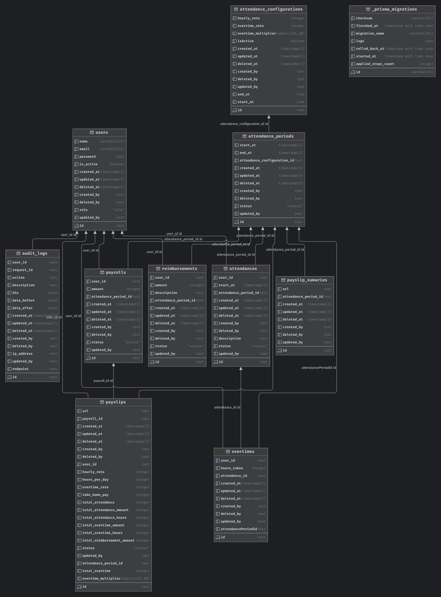

# Purwoko Payroll Backend

## Business Process

### Goal

Create MVP and scalable Payroll System with defined prorate rules

### Specification

#### User Involved

- Admin
- Employee

#### Access Control

- Admin
    - Admin can define salary rules for each user
    - Admin can define attendance configuration containing shift start and end time, example: 9AM to 5PM
    - Admin can create attendance period, normally should be monthly. After the period is completed (when admin proceed
      to generate payroll), then admin can must new period for next month so the employees can create new attendance
      record
    - Admin can generate payroll for employee
    - Admin can view employee payslip summary
- Employee
    - Employee can create an attendance record
    - Employee can create overtime based on attendance record at any time
    - Employee can create reimbursement
    - Employee can view their payslip after payroll is generated by admin

#### Salary Rules

- Each employee has different salary rate
- hourly rate
- overtime multiplier
- overtime rate
- shift start time
- shift end time
- attendance period can be set at start of month to the end of month

#### Salary Components

- Base Salary (hourly)
- Overtime (hourly), maximum 3 hours, has multiplier of normal hourly salary
- Reimbursement, manually created by employee
- Take Home Pay = Base Salary + Overtime + Reimbursement for each attendance period

#### Business Lifecycle

1. Admin create attendance period
2. Employee can create attendance record
3. Admin can generate payroll
4. Employee can view payslip

## Architecture

### Software Architecture

This project is divided into 3 main services which is very simple

- Backend Service (Nodejs)
- Queue Service (Redis)
- Database Service (Postgres)

### Database Schema



## Requirements

- Nodejs
- Database (Postgres)
- Redis (Used for Queue)
- Docker (Optional)

## Tech Stack

- NestJS, API Framework
- Prisma, for Database ORM
- Bull, for Queue
- Docker

## Project setup

Copy `.env.example` to `.env` and `prod.env` and fill required values

```bash
$ copy .env.example .env
$ copy .env.example .prod.env
```

### Using Docker (Recommended)

Use `host.docker.internal` or `postgres` as database host while using docker because the container is running inside
docker environment

Run compose in detached mode

For development

```bash
$ docker compose up -d --build

# or with Makefile
$ make docker-dev
```

For production

```bash
$ docker compose -f docker-compose.prod.yml up -d --build

# or with Makefile
$ make docker-prod
```

Run migrations

```bash
$ make docker-migrate
```

Run seeders

```bash
$ make docker-seed
```

### Without Docker

Nodejs version was specified in `.nvmrc` file, so you can use the command below to install all the dependencies and

```bash
$ nvm use
```

Install dependencies

```bash
$ npm install
```

Run migrations

```bash
$ npm run prisma:migrate:dev
```

Run seeders

```bash
$ npm run prisma:seed
```

#### Compile and run the project

Run in Development

```bash
$ npm run start:dev
```

Run in Production

```bash
# Build the app
$ npm run build

# Run the app in production
$ npm run start:prod
```

### Docs

- Swagger docs are available at http://localhost:3000/swagger

- Bull board is available at http://localhost:3000/queues

### Run tests

```bash
# unit tests
$ npm run test

# test coverage
$ npm run test:cov
```

## Contribute to this project

### Git Client

Using "Fork" GIT clients is highly recommended

https://git-fork.com

### Semantic Standardization

- Branch name **should** prefix with `feat/fix/docs/refactor`. Example:
    - `feat/create-user-module`
- Commit message **must be** in this format `prefix: <changelog>`
    - Commit type:
        - `feat`, for a new feature or addition
        - `fix`, for any fixing codes
        - `refactor`, for a code refactor e.g : optimize projects structures
    - Examples:
        - `feat: change images format`
        - `fix: fix bug navigation issue on navbar`
        - `refactor: tidy up assets structure`
- Merge Request name should be same with task name. Example:
    - `Create User Module`
- Database migration should prefix with `alter/create/drop/initialize`. Example:
    - `create_user_table`
    - `alter_user_table_add_column_email`

### Standard Operating Procedure (SOP)

1. Create new branch from `dev` branch based on your tickets
2. Start Coding
3. Stage your code changes
4. Make a commit
5. Make a Merge Request on GitHub from your branch into `dev` and don't forget to add yourself as Assignee and Project
   Author as Reporter
6. Change branch to `dev` and start working on another tickets

## Project Structure

This project use modular structure. All modules contain in `modules` folder. Each module can be auto generated with nest
cli command

```bash
$ nest g resource <module-name>
```

For function that used across modules, placed them outside `modules` folder

## Queue

There is two queue in this project. One for processing **attendance** records and one for processing **payroll**.
Predict those
will be the highest hits in peak hours. Imagine having 1000 employees making an attendance record at about the same time
at 06:50 - 07:00. Also when admin want to generate payroll to all thousand employees. Queue is a good choice for this
scenario in terms of performance and scalability.

## Further Improvements

I am well aware that this project is imperfect and still need a lot of improvement. Here are some things that I would
like to improve

- [x] Set hourly rate for each employee
- [ ] Improve documentation
- [ ] Implement pagination
- [ ] Implement proper unit test and integration test
- [ ] Use redis for caching
- [ ] Use Sentry for monitoring
- [ ] Enhance security